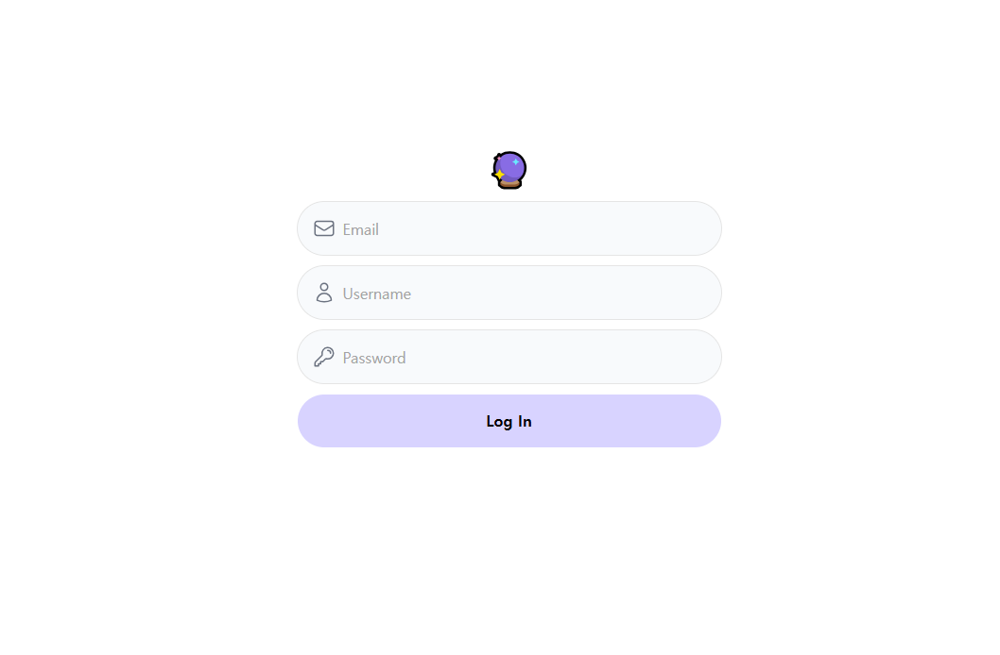

# Assignment 26

## Forms & Actions

### 챌린지 목표:

- Tailwind, Server Actions, useFormStatus, 그리고 useFormState 를 활용하여 빌드한다.

### Notes:

- 유저의 비밀번호가 '12345' 라면, 성공 메시지를 보여야 하고 아닐 경우 에러 메시지를 보여야 한다.

